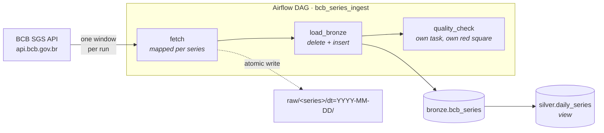

# bcb-airflow-pipeline

Incremental, backfillable ingestion of Brazilian Central Bank (BCB) time series
into a Postgres warehouse, orchestrated with Apache Airflow 3.

> Orchestration patterns I run daily on Databricks Workflows, implemented in Airflow.

The point of this repository is not that it moves data,that part is small on
purpose. It is that the pipeline is **correct under re-runs**: any interval can
be replayed, in any order, any number of times, and converge to the same rows.
Everything below follows from that one requirement.

---

## Architecture



Four series today (Selic target, USD/BRL PTAX, IPCA, IGP-M). Adding a fifth is
one line in `include/config.py`; the DAG maps over the registry dynamically and
needs no change.

---

## Design decisions

This is the section I would want to read first as a reviewer.

### Every boundary comes from the data interval, never from `now()`

Each run receives `data_interval_start` / `data_interval_end` and processes
exactly that window. No call to `datetime.now()` exists anywhere in the DAG.
This is what makes a backfill of last March produce March's data rather than
today's, and it is the single most common thing tutorials get wrong.

The Airflow interval is half-open (`[start, end)`) while the BCB API window is
inclusive on both ends, so `fetch` subtracts one day before calling out.
Adjacent runs therefore cannot claim each other's rows, and
`test_interval_end_is_exclusive` pins that down.

### Idempotency is delete-then-insert, in one transaction

`load_interval` deletes the rows the run owns and re-inserts them atomically.
Re-running converges; a partial failure leaves nothing half-applied.

An upsert on `(series_name, obs_date)` would also avoid duplicates, but it
would *not* remove rows the source has since retracted, and the BCB does
revise published series. Delete-insert makes the warehouse a faithful mirror of
the source window instead of an append-only log of everything ever seen.

### Quality checks are a separate task, not a branch inside the load

When `quality_check` goes red, the Grid view tells you the data arrived and was
wrong. When `load_bronze` goes red, the load itself broke. Those are different
incidents with different responders, so they get different squares.

The checks encode domain knowledge rather than generic assertions. The
interesting one is emptiness: an empty window is an **error** for a daily
series on a business day, and completely **expected** on weekends, on holidays,
and for monthly series queried on a daily grain. A naive `assert rows` fails
every Saturday and trains you to ignore the alert.

### One mapped task per series

`fetch.expand(series=...)` creates one task instance per series at runtime
(Airflow's dynamic task mapping). A failing series retries alone instead of
dragging the other three through the retry cycle, and the Grid view shows which
source is broken without opening a log.

### The API client treats rate limits as normal, not exceptional

`429` and `5xx` are retried with exponential backoff plus jitter. Any other
`4xx` fails immediately, retrying a malformed request never helps, and burning
five attempts on a `404` only delays the alert. A `200` carrying non-JSON (the
BCB's failure mode under load) is treated as retryable.

Concurrency against the API is bounded by an Airflow **pool** rather than by
`sleep()`, so the limit holds across a wide backfill where many runs are in
flight at once.

### Atomic landing-zone writes

`write_atomic` writes to a temp file in the destination directory and then
`os.replace`s it. A task killed mid-write leaves no truncated file for a later
run to read as if it were complete. Paths are a pure function of
`(series, interval_start)`, so re-running overwrites in place.

### Two databases, on purpose

The warehouse is a separate Postgres from Airflow's metadata database. Sharing
them is convenient in a demo and indefensible anywhere else, a warehouse query
that locks a table should never be able to stall the scheduler.

---

## Running it

Requires Docker and about 4 GB of RAM.

```bash
make init     # downloads the official Airflow compose, creates .env
make up       # starts Airflow + the warehouse
make test     # test suite, no Docker or network required
```

Airflow UI: <http://localhost:8080>

Create the pool the fetch task uses (once), then backfill a month:

```bash
docker compose run --rm airflow-cli airflow pools set bcb_api 2 "BCB API rate limit"
make backfill FROM=2026-08-01 TO=2026-08-31
```

Inspect what landed:

```bash
make psql
# select series_name, count(*), min(obs_date), max(obs_date)
#   from bronze.bcb_series group by 1 order by 1;
```

### Proving idempotency

Clear any completed task in the Grid view and let it re-run, then re-count. The
row count does not change. That is the whole thesis of the repository, and it
takes ten seconds to check.

---

```text
bcb-airflow-pipeline/
├── dags/
│   └── bcb_ingest.py              # a DAG: fetch → load_bronze → quality_check
├── include/
│   ├── config.py                  # series registry, adding one is a 1-line change
│   ├── bcb_client.py              # SGS client: retry/backoff, 4xx fails fast
│   ├── storage.py                 # atomic landing-zone writes (tmp + rename)
│   ├── warehouse.py               # delete-insert per interval, one transaction
│   └── quality.py                 # pure assertion rules, unit-tested
├── sql/
│   ├── 001_bronze.sql             # bronze table + PK, runs on first boot
│   └── 002_silver.sql             # silver view — the designed extension point
├── tests/
│   ├── test_bcb_client.py         # parsing, retries, failure modes (fixtures, no network)
│   ├── test_quality_and_storage.py
│   └── test_dag_integrity.py      # imports, retries, catchup, cycles
├── docker-compose.override.yaml   # separate warehouse Postgres + project mounts
├── Makefile                       # init · up · test · backfill · psql
├── requirements.txt
└── .env.example
```

---

## Tests

```
tests/test_bcb_client.py           # parsing, retries, backoff, failure modes
tests/test_quality_and_storage.py  # quality rules, atomic writes
tests/test_dag_integrity.py        # imports, retries, catchup, cycles
```

The suite runs without Docker, without Airflow and without network access,
every HTTP interaction is a fixture. `test_dag_integrity.py` skips itself when
Airflow is not installed, so `pytest` stays useful in a bare virtualenv.

The DAG integrity test is cheap and catches the failures that otherwise reach
the scheduler: import errors, a task with no retries, and `catchup` silently
falling back to `False` (Airflow 3 changed that default).

---

## Where this grows

The repository is complete as it stands — bronze is loaded, validated and
backfillable. These are the seams, in the order I would actually build them:

| Next | What it adds | Where it plugs in |
|---|---|---|
| **Materialise silver** | `silver.daily_series` is a view today; make it an incremental table loaded by a second DAG | Trigger on the `BRONZE` asset, the `outlets=[BRONZE]` is already declared |
| **dbt for silver → gold** | Tests and lineage on the transformation layer | Replace `sql/002_silver.sql` with dbt models; add a `dbt run` task |
| **A second source** | Pagination and OData query building | Implement a `fetch_series`-compatible function against Olinda (`olinda.bcb.gov.br/olinda/servico/.../odata/`) and register it in `include/config.py` |
| **Alerting** | Failures reach a human | `on_failure_callback` on `DEFAULT_ARGS` |
| **Great Expectations** | Declarative, versioned expectations | Swap the body of `include/quality.py`; the task boundary stays |

## What I would do differently in production

- **Object storage, not a local volume.** The landing zone would be S3/ADLS
  with lifecycle rules; `include/storage.py` is deliberately small so the
  backend is a one-file change.
- **Bake an image.** `_PIP_ADDITIONAL_REQUIREMENTS` installs dependencies at
  container start, which is fine for a laptop and unacceptable for a deploy.
- **Secrets from a real backend.** Azure Key Vault or AWS Secrets Manager via
  Airflow's secrets backend, not environment variables.
- **A freshness SLA.** Right now nothing complains if a run simply never fires.
- **Schema contracts on the source.** Today a silently added API field is
  ignored; it should be detected.

---

## Series ingested

| Code | Name | Frequency | Unit |
|---|---|---|---|
| 432 | `selic_meta` | daily | % p.a. |
| 1 | `usd_brl_ptax` | daily | BRL/USD |
| 433 | `ipca` | monthly | % p.m. |
| 189 | `igpm` | monthly | % p.m. |

Source: [BCB SGS API](https://dadosabertos.bcb.gov.br/), public and unauthenticated.
