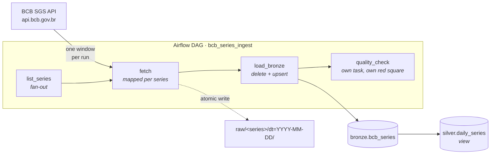
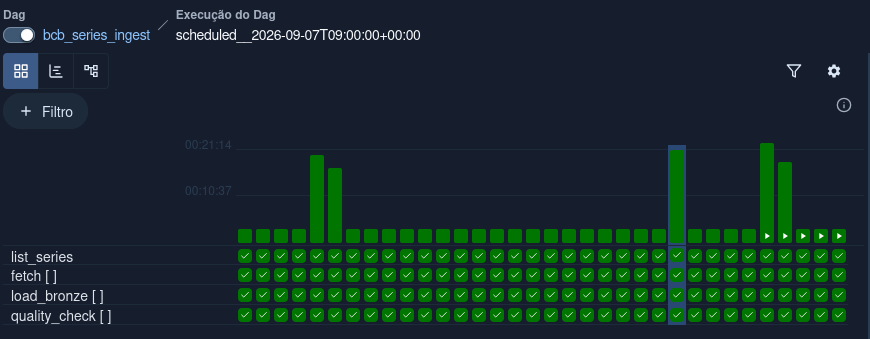

# Maré

### The tide goes out and comes back in. The level is always the same.

Incremental, backfillable ingestion of Brazilian Central Bank (BCB) time series
into a Postgres warehouse, orchestrated with Apache Airflow 3.

<p>
  
  
  
  
  
</p>

**English** · [Português](README.pt-BR.md)

<br clear="all">

## Why I built this

I orchestrate pipelines on Databricks Workflows most days. The patterns that
actually keep me out of trouble there (runs scoped to an interval, loads that
converge, quality failures that are their own incident) have nothing to do
with the platform, and I wanted them written down somewhere I could point at.

So this repository is small on purpose. Moving four public series from an open
API into Postgres is not the hard part. The hard part is that a pipeline is
never run once: it is re-run after a fix, backfilled after an outage, replayed
when someone changes their mind about last March. Most examples quietly assume
the happy path where every run happens exactly once, in order. This one assumes
the opposite, and every decision below follows from that.

That is the tide. The data goes out and comes back, and the level is always the
same.

Several of the decisions below are not what I wrote first. They are what a
30-day backfill against a live API forced me to write instead, and I have kept
the original reasoning visible where it was wrong.

---

## Architecture



Four series today (Selic target, USD/BRL PTAX, IPCA, IGP-M). Adding a fifth is
one line in `include/config.py`; the DAG maps over the registry dynamically and
needs no change.

---

## Design decisions

This is the section I would want to read first as a reviewer.

### Every boundary comes from the data interval, never from `now()`

Each run receives `data_interval_start` / `data_interval_end` and processes
exactly that window. No call to `datetime.now()` exists anywhere in the DAG.
This is what makes a backfill of last March produce March's data rather than
today's, and it is the single most common thing tutorials get wrong.

The Airflow interval is half-open (`[start, end)`) while the BCB API window is
inclusive on both ends, so `fetch` subtracts one day before calling out.
Adjacent runs therefore cannot claim each other's rows, and a test pins that
down.

### The timetable is declared, not inferred

Airflow 3 turns a bare cron string into a `CronTriggerTimetable`, whose data
interval has zero width `start == end == run time`, because
`create_cron_data_intervals` now defaults to `False`. Every incremental pattern
here depends on a real interval, so the DAG declares
`CronDataIntervalTimetable` explicitly instead of inheriting it from global
config.

The symptom when you get this wrong is quiet: the fetch window collapses and
the API is asked for an inverted date range. Declaring the timetable in the DAG
rather than setting the global flag also means the behaviour travels with the
code, into any Airflow that runs it.

### Idempotency has two halves

`load_interval` deletes the rows the run owns, keyed on `interval_start`, the
interval that wrote them, not on the observation date, and re-inserts them in
one transaction.

Deleting by observation date looks equivalent and is not. The BCB dates a
monthly series on the 1st of the reference month and hands it back to whichever
daily window picks it up, so a run whose window is the 3rd inserts a row dated
the 1st. A delete keyed on the window would never reclaim that row.

That alone still isn't enough: two different runs can legitimately claim the
same `(series, date)`, so the insert is `ON CONFLICT DO UPDATE` and the later
run takes ownership instead of colliding with the primary key.

The delete half is what handles **retractions**, the BCB revises published
series, and a row that vanishes from the source window is removed rather than
left behind as a stale orphan. A bare upsert would never notice.

This is the one decision here that I got wrong twice before a 30-day backfill
corrected me.

### Quality checks are a separate task, not a branch inside the load

When `quality_check` goes red, the Grid view tells you the data arrived and was
wrong. When `load_bronze` goes red, the load itself broke. Those are different
incidents with different responders, so they get different squares.

The checks encode domain knowledge rather than generic assertions. The
interesting one is emptiness, and it has three shapes: a daily series returns
nothing on weekends, nothing on national holidays, and a monthly series returns
nothing on most days. The first version only knew about weekends, so the run
for Monday 7 September 2026 (Independence Day) failed a quality check on
correct data. Nine Brazilian holidays fall on a weekday in 2026; a check that
cries wolf nine times a year is a check people learn to ignore.

### One mapped task per series

`fetch.expand(series=...)` creates one task instance per series at runtime
(Airflow's dynamic task mapping). A failing series retries alone instead of
dragging the other three through the retry cycle, and the Grid view shows which
source is broken without opening a log.

### The API client treats absence as an answer, not a fault

`429` and `5xx` are retried with exponential backoff plus jitter. `404` is not
an error at all: SGS answers 404, rather than an empty `200`, when a series has
no observation inside the requested window, which monthly series hit on most
days. Any other `4xx` fails immediately, because retrying a malformed request
never helps. A `200` carrying non-JSON (the BCB's failure mode under load) is
treated as retryable.

The cost of reading 404 that way is real and worth naming: a wrong series code
in `config.py` also returns 404, and would be a silently empty series forever.
Validating the codes once at config load is the fix, listed below.

Concurrency against the API is bounded by an Airflow **pool** rather than by
`sleep()`, so the limit holds across a wide backfill where many runs are in
flight at once.

### The asset URI is a name, not a connection string

`Asset("postgres://…")` is validated by the Postgres provider's URI normaliser,
which demands `host/database/schema/table`, and hardcoding the database name
would couple the DAG to one deployment's `.env`. The asset is a logical
identifier for "the bronze table"; the connection comes from `WAREHOUSE_DSN`.
A neutral scheme keeps the two separate.

### Every service that runs user code gets the project mounts

Under CeleryExecutor the scheduler parses the DAG but the *worker* executes it.
Mounting `include/` only on the scheduler produces a DAG that appears in the UI
and fails at runtime with `ModuleNotFoundError`. `airflow-worker` and
`airflow-cli` carry the same env and mounts as the scheduler for that reason.

### Atomic landing-zone writes

`write_atomic` writes to a temp file in the destination directory and then
`os.replace`s it. A task killed mid-write leaves no truncated file for a later
run to read as if it were complete. Paths are a pure function of
`(series, interval_start)`, so re-running overwrites in place.

### Two databases, on purpose

The warehouse is a separate Postgres from Airflow's metadata database. Sharing
them is convenient in a demo and indefensible anywhere else: a warehouse query
that locks a table should never be able to stall the scheduler.

---

## Running it

Requires Docker and about 4 GB of RAM.

```bash
make init     # downloads the official Airflow compose, creates .env
make up       # starts Airflow + the warehouse
make test     # test suite, no Docker or network required
```

Airflow UI: <http://localhost:8080>: user `airflow`, password `airflow`, created by the init container on first start. If the login is rejected it usually has not finished; `docker compose logs airflow-init` will say so.

Create the pool the fetch task uses (once), then backfill a month:

```bash
docker compose exec airflow-scheduler airflow pools set bcb_api 1 "BCB API rate limit"
make backfill FROM=2026-08-03 TO=2026-08-31
```

Inspect what landed:

```bash
make psql
# select series_name, count(*), min(obs_date), max(obs_date)
#   from bronze.bcb_series group by 1 order by 1;
```

```text
 series_name  | linhas |    min     |    max
--------------+--------+------------+------------
 igpm         |      1 | 2026-08-01 | 2026-08-01
 ipca         |      1 | 2026-08-01 | 2026-08-01
 selic_meta   |     29 | 2026-08-03 | 2026-08-31
 usd_brl_ptax |     21 | 2026-08-03 | 2026-08-31
```

The Selic target is defined for every calendar day; PTAX only quotes on
business days. The Friday run covers Friday through Monday, so the weekend is
picked up by the window that owns it, 29 rows against 21 is the pipeline
behaving correctly, not a gap.

### Proving it in ten seconds

Clear a completed run and let it re-execute. The row count does not change.
That is the whole thesis of the repository, and it is the one claim here you
can falsify yourself in under a minute.

```bash
$ psql -tAc "select count(*) from bronze.bcb_series;"
69
$ airflow tasks clear bcb_series_ingest -s 2026-08-24 -e 2026-08-25 --yes
$ psql -tAc "select count(*) from bronze.bcb_series;"
69
```

### The tide, running



---

## Layout

```text
bcb-airflow-pipeline/
├── dags/
│   └── bcb_ingest.py              # one DAG: fetch → load_bronze → quality_check
├── include/
│   ├── config.py                  # series registry: adding one is a 1-line change
│   ├── bcb_client.py              # SGS client: retry/backoff, 404 as empty window
│   ├── storage.py                 # atomic landing-zone writes (tmp + rename)
│   ├── warehouse.py               # delete by owning interval + ON CONFLICT
│   └── quality.py                 # pure assertion rules, holiday-aware
├── sql/
│   ├── 001_bronze.sql             # bronze table + PK, runs on first boot
│   └── 002_silver.sql             # silver view: the designed extension point
├── tests/
│   ├── test_bcb_client.py         # parsing, retries, failure modes (fixtures, no network)
│   ├── test_quality_and_storage.py
│   └── test_dag_integrity.py      # imports, retries, catchup, cycles
├── docs/
│   └── img/                       # screenshots referenced above
├── docker-compose.override.yaml   # separate warehouse Postgres + project mounts
├── Makefile                       # init · up · test · backfill · psql
├── requirements.txt
└── .env.example
```

---

## Tests

```
tests/test_bcb_client.py           # parsing, retries, backoff, failure modes
tests/test_quality_and_storage.py  # quality rules, holidays, atomic writes
tests/test_dag_integrity.py        # imports, retries, catchup, cycles
```

The suite runs without Docker, without Airflow and without network access,
every HTTP interaction is a fixture. `test_dag_integrity.py` skips itself when
Airflow is not installed, so `pytest` stays useful in a bare virtualenv.

The DAG integrity test is cheap and catches the failures that otherwise reach
the scheduler: import errors, a task with no retries, and `catchup` silently
falling back to `False` (Airflow 3 changed that default).

`requirements.txt` pins `apache-airflow-providers-postgres` for the same
reason: the integrity test only catches provider-level problems, an invalid
Asset URI, for instance, when the test environment has the same providers as
the runtime. Without it the suite went green on a DAG that could not load.

---

## Where this grows

The repository is complete as it stands, bronze is loaded, validated and
backfillable. These are the seams, in the order I would actually build them:

| Next | What it adds | Where it plugs in |
|---|---|---|
| **Validate series codes at startup** | A wrong code in `config.py` is currently a silently empty series, because 404 means both "no data in this window" and "no such series" | A one-off check per code against a wide window, run at config load |
| **A monthly DAG** | Removes the root cause behind two of the workarounds above | IPCA and IGP-M move to their own schedule; the daily DAG stops asking for them |
| **Materialise silver** | `silver.daily_series` is a view today; make it an incremental table loaded by a second DAG | Trigger on the `BRONZE` asset `outlets=[BRONZE]` is already declared and emitting events |
| **dbt for silver → gold** | Tests and lineage on the transformation layer | Replace `sql/002_silver.sql` with dbt models; add a `dbt run` task |
| **A second source** | Pagination and OData query building | Implement a `fetch_series`-compatible function against Olinda (`olinda.bcb.gov.br/olinda/servico/.../odata/`) and register it in `include/config.py` |
| **Alerting** | Failures reach a human | `on_failure_callback` on `DEFAULT_ARGS` |
| **Great Expectations** | Declarative, versioned expectations | Swap the body of `include/quality.py`; the task boundary stays |

## What I would do differently in production

- **Object storage, not a local volume.** The landing zone would be S3/ADLS
  with lifecycle rules; `include/storage.py` is deliberately small so the
  backend is a one-file change.
- **Bake an image.** `_PIP_ADDITIONAL_REQUIREMENTS` installs dependencies at
  container start, which is fine for a laptop and unacceptable for a deploy.
- **Secrets from a real backend.** Azure Key Vault or AWS Secrets Manager via
  Airflow's secrets backend, not environment variables.
- **Authentication.** The local compose ships Airflow's FAB auth manager with a
  single `airflow` / `airflow` account created on first start, fine for a laptop
  bound to localhost holding public data. A deployed instance would use a real
  identity provider and no default credentials.
- **A freshness SLA.** Right now nothing complains if a run simply never fires.
- **Schema contracts on the source.** Today a silently added API field is
  ignored; it should be detected.

---

## Series ingested

| Code | Name | Frequency | Unit |
|---|---|---|---|
| 432 | `selic_meta` | daily | % p.a. |
| 1 | `usd_brl_ptax` | daily | BRL/USD |
| 433 | `ipca` | monthly | % p.m. |
| 189 | `igpm` | monthly | % p.m. |

Source: [BCB SGS API](https://dadosabertos.bcb.gov.br/) public and unauthenticated.

---

<p align="center">
  Built by <b>Karla Oliveira</b> · <a href="https://github.com/kabianca">@kabianca</a>
<!-- · <a href="https://www.linkedin.com/in/karlaboliveira/">LinkedIn</a> -->
  <br>
  <sub>Licensed under GPL-3.0 · Questions and critique are welcome | open an issue.</sub>
</p>

<sub>Licensed under GPL-3.0, by preference rather than by default, same
reason I have been translating KDE since 2012. Questions and critique are
welcome; open an issue.</sub>
