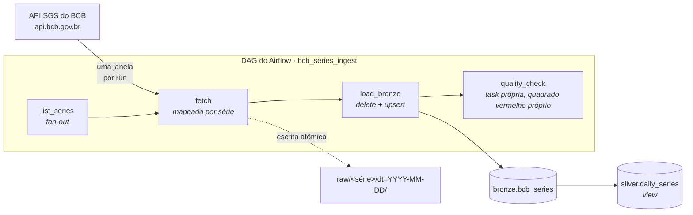

# Maré

### Os dados vão e voltam, mas o volume permanece constante.

Ingestão incremental e _backfill_ das séries temporais do Banco Central do Brasil (BCB) para um _warehouse_ Postgres, orquestrado com Apache Airflow 3.

<p>
  
  
  
  
  
</p>

[English](README.md) · **Português**

<br clear="all">

## Por que eu construí isso

Eu orquestro pipelines em Databricks Workflows quase todos os dias. Os padrões que de fato me livram de problema lá (runs com objetivo, execução com intervalo adequado, cargas que convergem, falha de qualidade como incidente próprio) não têm nada a ver com a plataforma e eu queria demonstrar isso. Entender o conceito é completamente diferente de performar em uma única plataforma.

Por isso este repositório é pequeno de propósito. Mover quatro séries públicas de uma API aberta para o Postgres não é a parte difícil. A parte difícil é que um pipeline nunca roda uma vez só: ele é reexecutado depois de um fix, sofre _backfill_ depois de uma indisponibilidade, é reprocessado quando alguém muda de ideia sobre março passado. A maioria dos exemplos assume silenciosamente o caminho feliz, em que cada _run_ acontece exatamente uma vez, em ordem. Este aqui assume o contrário e todas as decisões abaixo saem daí.

Várias decisões abaixo não são o que eu planejei a princípio. São o que um _backfill_ de 30 dias contra uma API viva me orientou a escrever no lugar, porém deixo explícito o raciocínio original para explicitar onde ele estava errado. Maré que sobe também redesenha a paisagem.

---

## Arquitetura



Hoje temos quatro séries (meta Selic, dólar PTAX, IPCA, IGP-M). A inclusão de uma quinta seria basicamente adicionar uma linha em `include/config.py`: a DAG mapeia dinamicamente sobre o registro e não precisa de nenhuma mudança.

---

## Decisões de design

Esta é a seção que eu leria primeiro se estivesse revisando o repositório.

### Todo limite vem do data interval, nunca de `now()`

Cada execução recebe `data_interval_start` / `data_interval_end` e processa exatamente aquela janela. Não existe uma única chamada a `datetime.now()` na DAG. É isso que faz um _backfill_ de março passado produzir os dados de março, e não os de hoje: um dos erros mais comums em tutorial de Airflow.

O intervalo do Airflow é semiaberto (`[início, fim)`), enquanto a janela da API do BCB é inclusiva nas duas pontas; por isso o `fetch` subtrai um dia antes de chamar a API. Assim, execuções próximas não reivindicam as linhas umas das outras e um teste garante a trava desse comportamento.

### O timetable é declarado, não inferido

O Airflow 3 transforma uma string cron pura em um `CronTriggerTimetable`, cujo _data interval_ tem largura zero (`início == fim == hora do run`), pois `create_cron_data_intervals` agora vem `False` por padrão. Todo padrão incremental daqui depende de um intervalo de verdade, então a DAG declara `CronDataIntervalTimetable` explicitamente em vez de herdar isso da configuração global.

O sintoma de errar aqui é silencioso: a janela do `fetch` colapsa e a API recebe um intervalo de datas invertido. Declarar o timetable na DAG, e não numa flag global, também faz o comportamento viajar junto com o código para qualquer Airflow que o execute.

### Idempotência tem duas metades

`load_interval` apaga as linhas que a execução possui (a chave é `interval_start`, o intervalo que as escreveu e não a data da observação) e as reinsere numa transação só.

Apagar pela data da observação parece equivalente e não é. O BCB data uma série mensal no dia 1º do mês de referência e a devolve para qualquer janela diária que a encontre, então uma execução cuja janela é o dia 3 insere uma linha datada do dia 1º. Um delete com chave na janela nunca recuperaria essa linha.

Isso sozinho ainda não basta: duas execuções diferentes podem legitimamente reivindicar a mesma `(série, data)`, então o insert é `ON CONFLICT DO UPDATE` e a execução mais recente assume a posse em vez de colidir com a chave primária.

A metade do delete é o que cuida das **retratações**: o BCB revisa séries publicadas, e uma linha que some da janela na origem é removida em vez de ficar para trás como órfã. Um _upsert_ puro nunca perceberia.

Essa é a única decisão aqui que eu errei duas vezes antes de um _backfill_ de 30 dias me corrigir.

### Checagem de qualidade é uma task separada, não um branch dentro da carga

Quando `quality_check` fica vermelha, a _Grid view_ diz que o dado chegou e estava errado. Quando `load_bronze` fica vermelha, foi a carga que quebrou. São incidentes diferentes, com responsáveis diferentes, então merecem quadrados diferentes.

As checagens carregam conhecimento de domínio, não asserções genéricas. A mais interessante é a de vazio, e ela tem três formas: uma série diária não devolve nada em fim de semana, não devolve nada em feriado nacional, e uma série mensal não devolve nada na maior parte dos dias. A primeira versão só conhecia o fim de semana, então a execução de segunda-feira, 7 de setembro de 2026 (Independência), reprovou dado correto na checagem de qualidade. Nove feriados brasileiros caem em dia útil em 2026; uma checagem que dispara falso positivo nove vezes por ano é uma checagem que as pessoas aprendem a ignorar.

### Uma task mapeada por série

`fetch.expand(series=...)` cria uma _task instance_ por série em tempo de execução (_dynamic task mapping_ do Airflow). Uma série que falha tenta de novo sozinha, em vez de arrastar as outras três pelo ciclo de retry, e a _Grid view_ mostra qual fonte quebrou sem precisar abrir log.

### O client da API trata ausência como resposta, não como falha

`429` e `5xx` são retentados com _backoff_ exponencial e _jitter_. `404` não é erro: o SGS responde 404, em vez de um `200`, quando uma série não tem observação dentro da janela pedida e séries mensais caem nisso na maioria dos dias. Qualquer outro `4xx` falha na hora, porque repetir uma requisição malformada nunca ajuda. Um `200` carregando algo que não é JSON (o modo de falha do BCB sob carga) é tratado como retentável.

O custo de ler 404 desse jeito é real e merece ser dito: um código de série errado em `config.py` também devolve 404 e seria uma série silenciosamente vazia para sempre. Validar os códigos uma vez, na carga da configuração, é a correção listada mais abaixo.

A concorrência contra a API é limitada por um **pool** do Airflow, e não por `sleep()`; assim o limite se mantém num _backfill_ amplo, na qual muitas execuções estão em andamento ao mesmo tempo.

### A URI do asset é um nome, não uma string de conexão

`Asset("postgres://…")` é validado pelo normalizador de URI do provider do Postgres, que exige `host/database/schema/table`, e fixar o nome do banco acoplaria a DAG ao `.env` de um deploy específico. O asset é um identificador lógico para "a tabela bronze"; a conexão vem de `WAREHOUSE_DSN`. Um esquema neutro mantém as duas coisas separadas.

### Todo serviço que executa código do usuário recebe os mounts do projeto

Com o _CeleryExecutor_, o _scheduler_ faz o parsing da DAG, mas quem executa é o _worker_. Montar `include/` só no scheduler produz uma DAG que aparece na interface e falha em tempo de execução com `ModuleNotFoundError`. Por isso, `airflow-worker` e `airflow-cli` carregam o mesmo env e os mesmos mounts do scheduler.

### Escrita atômica na landing zone

`write_atomic` escreve num arquivo temporário dentro do diretório de destino e depois faz `os.replace`. Uma task morta no meio da escrita não deixa arquivo truncado para uma execução posterior ler como se estivesse completo. Os caminhos são função pura de `(série, início do intervalo)`, então reexecutar sobrescreve no mesmo lugar.

### Dois bancos, de propósito

O _warehouse_ é um Postgres separado do banco de metadados do Airflow. Compartilhá-los é conveniente numem uma demo e indefensável em qualquer outro lugar: uma query que trava uma tabela jamais deveria conseguir parar o scheduler.

---

## Rodando

Precisa de Docker e uns 4 GB de RAM.

```bash
make init     # baixa o compose oficial do Airflow e cria o .env
make up       # sobe o Airflow + o warehouse
make test     # suíte de testes, sem Docker e sem rede
```

Airflow UI: <http://localhost:8080>: 

- usuário `airflow`
- senha `airflow`

Criados pelo
container de init no primeiro start. Se o login for recusado, normalmente é porque ele ainda não terminou => `docker compose logs airflow-init` mostra isso. Crie a pool que a task `fetch` usa (uma vez) e rode o _backfill_ de um mês:

```bash
docker compose exec airflow-scheduler airflow pools set bcb_api 1 "BCB API rate limit"
make backfill FROM=2026-08-03 TO=2026-08-31
```

Veja o que chegou:

```bash
make psql
# select series_name, count(*), min(obs_date), max(obs_date)
#   from bronze.bcb_series group by 1 order by 1;
```

```text
 series_name  | linhas |    min     |    max
--------------+--------+------------+------------
 igpm         |      1 | 2026-08-01 | 2026-08-01
 ipca         |      1 | 2026-08-01 | 2026-08-01
 selic_meta   |     29 | 2026-08-03 | 2026-08-31
 usd_brl_ptax |     21 | 2026-08-03 | 2026-08-31
```

A meta Selic é definida para todos os dias corridos; a PTAX só tem cotação em dia útil. A execução de sexta cobre de sexta a segunda, então o fim de semana é capturado pela janela à qual pertence: 29 linhas contra 21 é o pipeline se comportando corretamente, não uma lacuna.

### Provando isso em dez segundos

Limpe uma execução concluída e deixe-a reexecutar. O número de linhas não muda. Essa é a tese inteira do repositório e é a única afirmação aqui que você consegue falsificar em menos de um minuto.

```bash
$ psql -tAc "select count(*) from bronze.bcb_series;"
69
$ airflow tasks clear bcb_series_ingest -s 2026-08-24 -e 2026-08-25 --yes
$ psql -tAc "select count(*) from bronze.bcb_series;"
69
```

### O Maré rodando


<sub>Um mês de maré, quadrado por quadrado. A execução selecionada é o de 7 de setembro: o feriado que fez a checagem de qualidade olhar no calendário os feriados nacionais.</sub>

---

## Estrutura

```text
bcb-airflow-pipeline/
├── dags/
│   └── bcb_ingest.py              # uma DAG: fetch → load_bronze → quality_check
├── include/
│   ├── config.py                  # registro de séries: adicionar uma é 1 linha
│   ├── bcb_client.py              # client do SGS: retry/backoff, 404 como janela vazia
│   ├── storage.py                 # escrita atômica na landing zone (tmp + rename)
│   ├── warehouse.py               # delete pelo intervalo dono + ON CONFLICT
│   └── quality.py                 # regras puras de asserção, cientes de feriado
├── sql/
│   ├── 001_bronze.sql             # tabela bronze + PK, roda no primeiro boot
│   └── 002_silver.sql             # view silver: o ponto de extensão projetado
├── tests/
│   ├── test_bcb_client.py         # parsing, retries, modos de falha (fixtures, sem rede)
│   ├── test_quality_and_storage.py
│   └── test_dag_integrity.py      # imports, retries, catchup, ciclos
├── docs/
│   └── img/                       # prints referenciados acima
├── docker-compose.override.yaml   # Postgres do warehouse separado + mounts do projeto
├── Makefile                       # init · up · test · backfill · psql
├── requirements.txt
└── .env.example
```

---

## Testes

```
tests/test_bcb_client.py           # parsing, retries, backoff, modos de falha
tests/test_quality_and_storage.py  # regras de qualidade, feriados, escrita atômica
tests/test_dag_integrity.py        # imports, retries, catchup, ciclos
```

A suíte roda sem Docker, sem Airflow e sem acesso à rede: toda interação HTTP é fixture. O `test_dag_integrity.py` se auto-ignora quando o Airflow não está instalado, então o `pytest` continua útil numa virtualenv limpa.

O teste de integridade da DAG é barato e pega justamente as falhas que, sem ele, chegam no scheduler: erro de import, task sem retry e `catchup` caindo silenciosamente para `False` (o Airflow 3 mudou esse padrão).

O `requirements.txt` fixa `apache-airflow-providers-postgres` pelo mesmo motivo: o teste de integridade só pega problema de nível de provider (uma URI de Asset inválida, por exemplo) quando o ambiente de teste tem os mesmos providers do runtime. Sem isso, a suíte passava mesmo com uma DAG que não conseguia carregar.

---

## Por onde isso cresce

O repositório está completo como está: camada bronze é carregada, validada e suporta _backfill_. Porém, abaixo listo algumas benfeitorias na ordem em que eu realmente construiria:

| Próximo | O que adiciona | Onde encaixa |
|---|---|---|
| **Validar os códigos das séries na inicialização** | Um código errado em `config.py` hoje é uma série silenciosamente vazia, porque 404 significa tanto "sem dado nesta janela" quanto "série inexistente" | Uma verificação pontual por código contra uma janela ampla, executada no carregamento dda configuração |
| **Uma DAG mensal** | Remove a causa raiz por trás de dois dos contornos acima | IPCA e IGP-M passam para o próprio agendamento; a DAG diária para de pedi-los |
| **Materializar a silver** | `silver.daily_series` hoje é uma view; transforma-la em tabela incremental carregada por uma segunda DAG | DispO gatilho no asset `BRONZE`: o `outlets=[BRONZE]` já está declarado e emitindo eventos |
| **dbt para silver → gold** | Testes e linhagem na camada de transformação | Substituir `sql/002_silver.sql` por modelos dbt; adicionar uma task `dbt run` |
| **Uma segunda fonte** | Paginação e construção de consultas OData | Implementar uma função compatível com `fetch_series` contra a Olinda (`olinda.bcb.gov.br/olinda/servico/.../odata/`) e registrá-la em `include/config.py` |
| **Alertas** | Falhas chegam a um humano | `on_failure_callback` no `DEFAULT_ARGS` |
| **Great Expectations** | Expectativas declaradas e versionadas | Trocar o corpo de `include/quality.py`; a fronteira da task continua igual |

## O que eu faria diferente em produção

- **Armazenamento de objetos, não um volume local.** A _landing zone_ seria S3/ADLS com regras de ciclo de vida; `include/storage.py` é deliberadamente pequeno para que trocar o backend seja mudança de um único arquivo.
- **Gerar uma imagem já comdependências embutidas.** `_PIP_ADDITIONAL_REQUIREMENTS` instala dependências na inicialização do container: o que existe hoje é aceitável em um notebook pessoal, mas inaceitável em em deploy.
- **Segredos vindos de um backend de verdade.** Azure Key Vault ou AWS Secrets Manager via _secrets backend_ do Airflow, não variáveis de ambiente.
- **Autenticação.** O compose local vem com o gerenciador de autenticação FAB do Airflow e uma única conta `airflow` / `airflow` criada na primeira inicialização. Adequado para um projeto em localhost e contém dados públicos. Uma instância implantada usaria um provedor de identidade real e nenhuma credencial padrão.
- **Um SLA de frescor.** No momento, nada reclama se uma execução simplesmente nunca disparar.
- **Contrato de schema na origem.** Hoje um campo novo na API passa despercebido; deveria ser detectado.

---

## Séries ingeridas

| Código | Nome | Frequência | Unidade |
|---|---|---|---|
| 432 | `selic_meta` | diária | % a.a. |
| 1 | `usd_brl_ptax` | diária | BRL/USD |
| 433 | `ipca` | mensal | % a.m. |
| 189 | `igpm` | mensal | % a.m. |

Fonte: [API SGS do BCB](https://dadosabertos.bcb.gov.br/), pública e sem autenticação.

---

<p align="center">
  Feito por <b>Karla Oliveira</b> · <a href="https://github.com/kabianca">@kabianca</a>
  <!-- · <a href="https://www.linkedin.com/in/karlaboliveira/">LinkedIn</a> -->
  <br>
  <sub>Licenciado sob GPL-3.0, por preferência e não por padrão: o mesmo motivo pelo qual traduzo o KDE desde 2012. Dúvidas e críticas são bem-vindas; abra uma issue.</sub>
</p>
